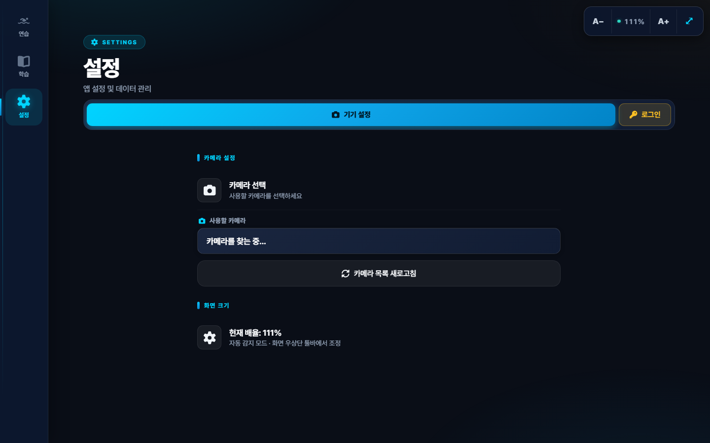
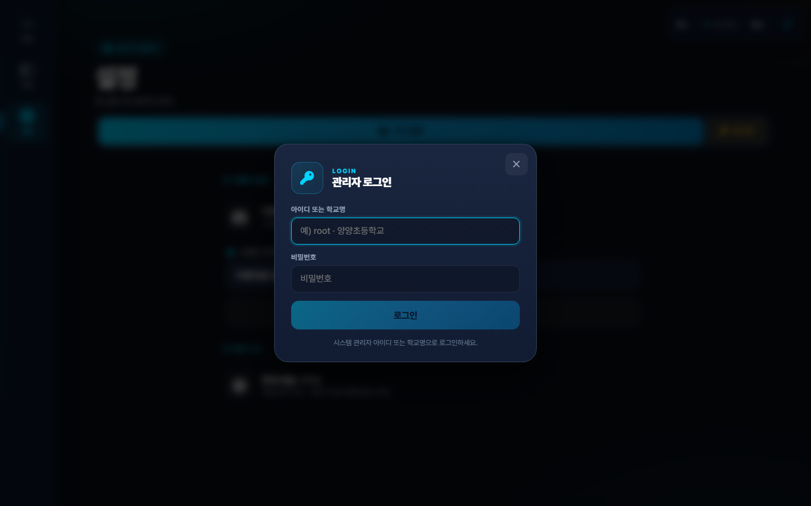
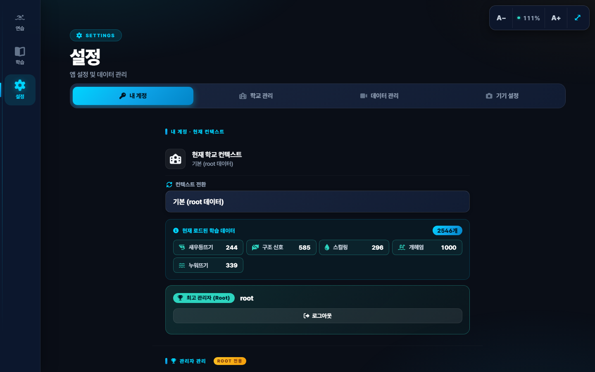
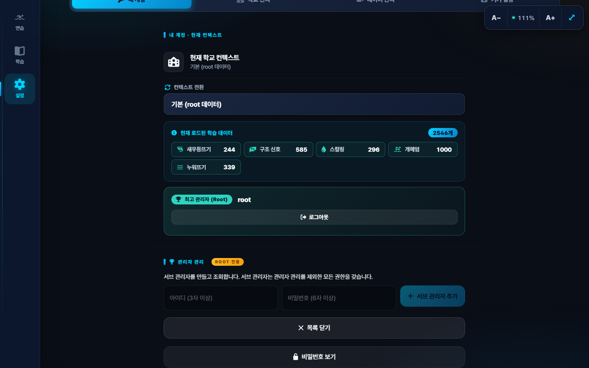
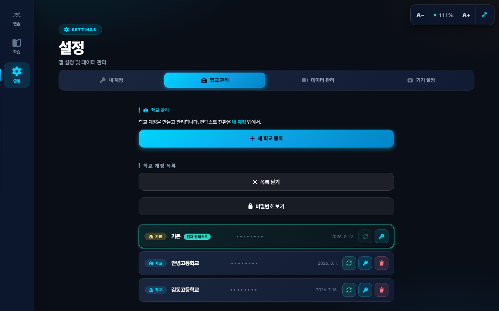
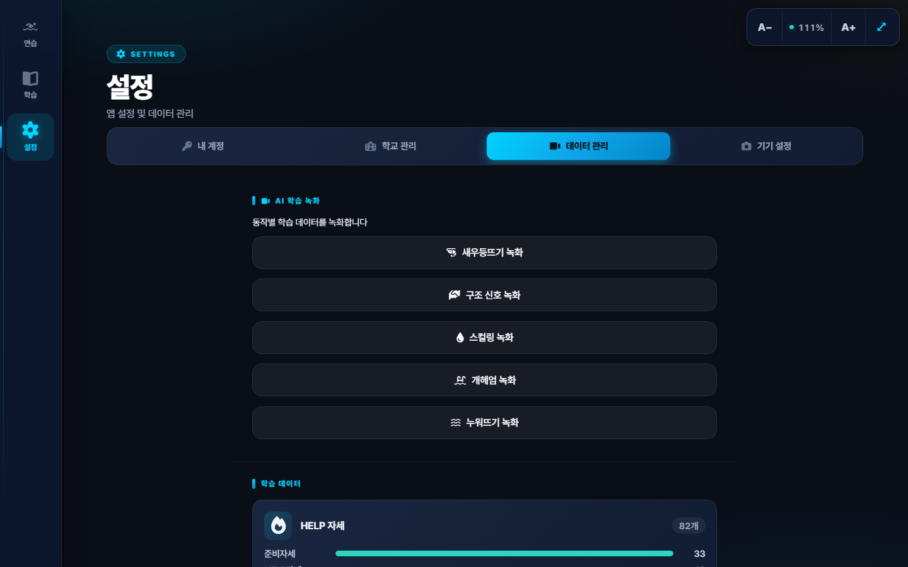
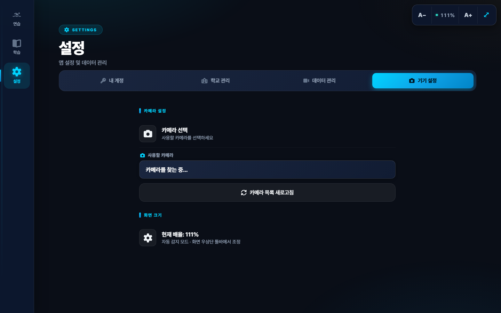
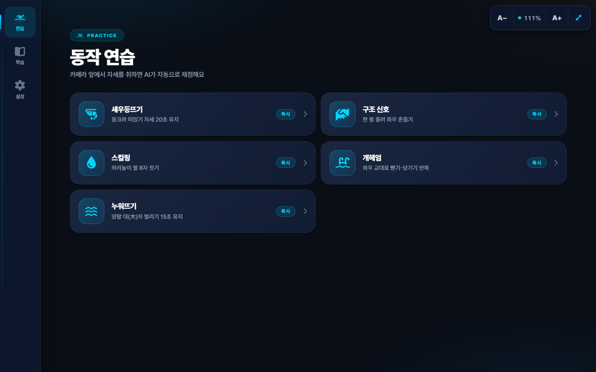
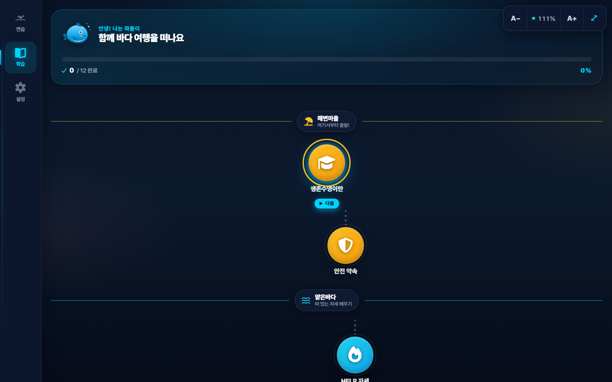
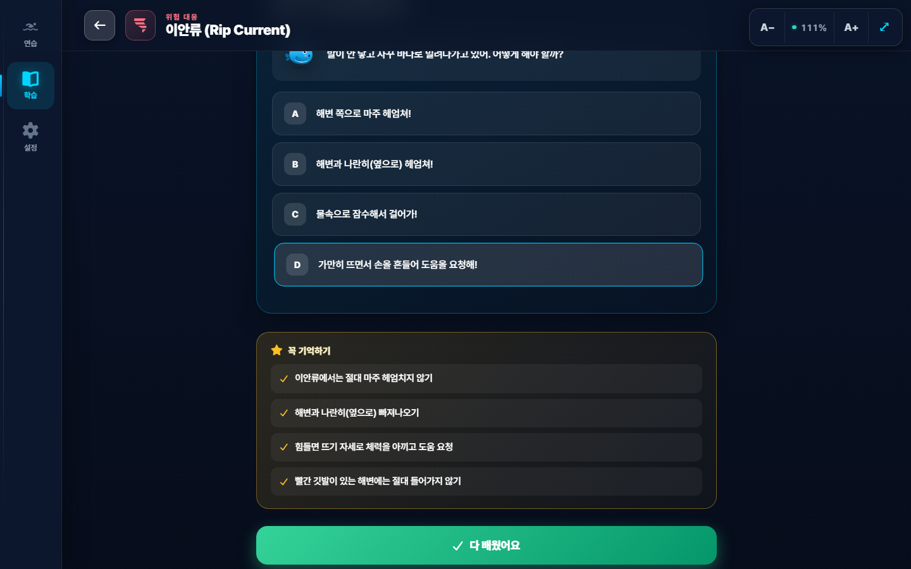

# 생존수영 AI 트레이너 — 설치 가이드

**대상**: 유치원·초등학교 담당 선생님, 학교 IT 담당자
**버전**: v1.0 · 2026년 7월

---

## 1. 프로그램 소개

**생존수영 AI 트레이너**는 웹캠 영상으로 학생의 자세를 실시간 분석해 자동 채점하는 교육용 프로그램입니다. 별도 설치 없이 인터넷 브라우저에서 바로 사용할 수 있습니다.

### 주요 기능
- **6대 생존수영 동작 실시간 분석** — HELP 자세, 새우등뜨기, 구조 신호, 스컬링, 개헤엄, 누워뜨기
- **이론 학습 콘텐츠** — 이안류·저류·바다 지형 등 실제 해양 사고 대응 (양양초 문주호 수석 요청 반영)
- **학교별 데이터 관리** — 학교마다 독립된 학습 데이터 공간
- **대형 터치 모니터 최적화** — 75~86인치 화면 자동 스케일링

> 💡 **웹앱이라 설치가 없습니다.** 인터넷 주소만 열면 됩니다. 소프트웨어 업데이트도 자동입니다.

---

## 2. 준비물 체크리스트

### 필수 하드웨어
- [ ] 디스플레이 — **대형 터치 모니터 (권장 55~86인치)** 또는 노트북/태블릿
- [ ] 웹캠 — 학생 시연용 별도 웹캠 (풀 HD 이상 권장)
- [ ] 인터넷 연결 — 안정적인 유선 또는 Wi-Fi
- [ ] 브라우저 — Chrome, Edge, Safari 최신 버전

### 선택 사항
- [ ] 빔프로젝터 (터치 모니터가 없을 경우)
- [ ] 무선 마우스 (강사 조작용)
- [ ] 스피커 (효과음 활용시)

> ⚠ **카메라 위치가 정확도를 좌우합니다.** 학생 전신이 나오도록 카메라를 벽에서 2~3m, 높이 1.2m 정도에 고정하세요.

---

## 3. 첫 설치 (5단계)

### 1️⃣ 인터넷 주소 열기
브라우저(Chrome/Edge)에서 아래 주소를 입력하세요.

```
https://swim-survival-trainer.vercel.app
```

### 2️⃣ 홈 화면에 추가 (앱처럼 사용)
브라우저 주소창 우측 `⋮` 메뉴 → **"홈 화면에 추가"** 또는 **"앱 설치"** 클릭.
이후엔 바탕화면·시작메뉴 아이콘으로 앱처럼 실행할 수 있습니다.

### 3️⃣ 웹캠 권한 허용
첫 실행시 브라우저가 카메라 접근 권한을 요청합니다. **"허용"**을 선택하세요.
여러 웹캠이 있으면 **설정 → 기기 설정 → 카메라 선택**에서 원하는 카메라를 지정합니다.

### 4️⃣ 화면 크기 조정
우상단 `A− / A+` 버튼으로 글자·요소 크기 조절 가능.
`⤢` 버튼을 누르면 자동으로 이 모니터에 최적화된 크기로 조정됩니다.

### 5️⃣ 학교 관리자 로그인
설정 탭 → **"관리자 로그인"** 클릭.



단일 로그인 폼에 **학교명**과 **비밀번호** 입력.



계정이 없으면 시스템 관리자에게 학교 계정 생성을 요청하세요.

---

## 4. 관리자 계정 안내

3단계 권한 구조입니다. 학교 담당 선생님은 **학교 관리자** 계정을 사용합니다.

| 역할 | 대상 | 권한 |
|---|---|---|
| **ROOT** | 개발자 · 시스템 운영자 | 전체 권한 + 서브 관리자 생성/삭제 |
| **SUB** | 지역 담당자 · 운영 조력 | 학교 계정 생성/관리, 컨텍스트 전환 (관리자 관리 제외) |
| **SCHOOL** | 학교 담당 선생님 | 자기 학교 데이터 관리, AI 학습 녹화, 일상 사용 |

> **로그인 방법**: 아이디 또는 학교명 하나만 입력하면 시스템이 자동으로 판별합니다.
> 예) `root` / `양양초등학교`

### 로그인 후 화면



**Root 전용 · 관리자 관리** — 서브 관리자를 생성/조회/삭제.



**학교 관리 탭** (root+sub) — 학교 계정 관리, 각 행의 🔄 초록 버튼으로 컨텍스트 전환.



**데이터 관리 탭** — 각 동작의 AI 학습 데이터를 녹화·업로드·삭제.



**기기 설정 탭** — 로그인 없이도 접근 가능.



---

## 5. 매일 사용 흐름

### 수업 표준 흐름 (60분 기준)

| 시간 | 단계 | 강사 조작 |
|---|---|---|
| ~5분 | 준비 | 앱 실행, 카메라 확인, 학교 로그인 |
| ~20분 | 이론 학습 | 학습 탭에서 이안류·저류·6대 동작 설명 |
| ~30분 | 실습 (순환) | 연습 탭 → 동작 선택 → 학생 한 명씩 5분씩 시연 |
| ~5분 | 정리 | 연습 종료, 필요시 데이터 저장 |

### 화면 구성 3탭
- **연습** — 카메라 앞에서 자세 시연 · 실시간 AI 채점
- **학습** — 이론 콘텐츠 (생존수영 소개 · 안전수칙 · 이안류/저류 · 각 동작 상세 · CPR)
- **설정** — 계정 · 학교 관리 · 데이터 관리 · 기기 설정

### 연습 탭



### 학습 탭 — Duolingo 스타일 여정



### 학습 상세 — 이안류 예시



---

## 6. 자주 겪는 문제 (FAQ)

**Q. 카메라가 안 켜져요.**
A. 브라우저 주소창 왼쪽 자물쇠 아이콘 클릭 → 카메라 권한을 "허용"으로 설정. 그래도 안 되면 브라우저 재시작.

**Q. "저장된 샘플 없음" 이라고 뜹니다.**
A. 우리 학교의 AI 학습 데이터가 아직 없다는 뜻입니다. 학교 관리자로 로그인 후 **설정 → 데이터 관리 → AI 학습 녹화**에서 동작별 샘플을 등록하면 이후 정확도가 크게 향상됩니다.

**Q. 화면이 작아 보여요 / 크게 보이지 않아요.**
A. 우상단 `A+` 버튼을 눌러 확대하세요. 또는 `⤢` 자동 감지 버튼을 누르면 이 모니터에 최적 크기로 조정됩니다.

**Q. 뒤로 가려면 어떻게 하나요?**
A. 연습 화면 좌상단 `← 뒤로` 버튼. 학습 콘텐츠는 좌상단 `←` 화살표. 키보드 `ESC`도 지원.

**Q. 학교명/비밀번호를 잊어버렸어요.**
A. 시스템 관리자(개발자)에게 문의하세요. 재발급 가능합니다.

**Q. 인터넷이 끊기면 사용 못 하나요?**
A. 첫 로딩 이후에는 카메라 분석 자체는 로컬에서 돌아갑니다. 다만 학교 데이터 로드·업로드는 인터넷이 필요합니다.

**Q. 여러 학교에서 같은 계정을 써도 되나요?**
A. 한 학교당 하나의 계정 사용을 권장합니다. 학교별로 학습 데이터가 완전히 격리되므로, 계정을 공유하면 다른 학교 데이터를 볼 수 있게 됩니다.

---

## 7. 운영 시 유의사항

- **학생 개인정보 저장 없음** — 이 프로그램은 학생 이름·얼굴 정보를 저장하지 않습니다. 자세 특징 벡터만 임시 사용.
- **학교 계정 비밀번호 공유 주의** — 학교 데이터 삭제 권한이 있으니 담당 선생님 외 노출 금지.
- **수업 종료 후 로그아웃** — 공용 화면이면 반드시 설정 → 로그아웃.
- **웹캠 커버** — 사용하지 않을 때는 웹캠 렌즈를 물리적으로 가려 프라이버시 확보.

---

## 지원 문의

설치·사용 중 어려움이 있으시면 언제든 연락 주세요.

**이메일**: peter9167@naver.com

화상 지원(Google Meet, Zoom)으로 원격 안내 가능합니다.
